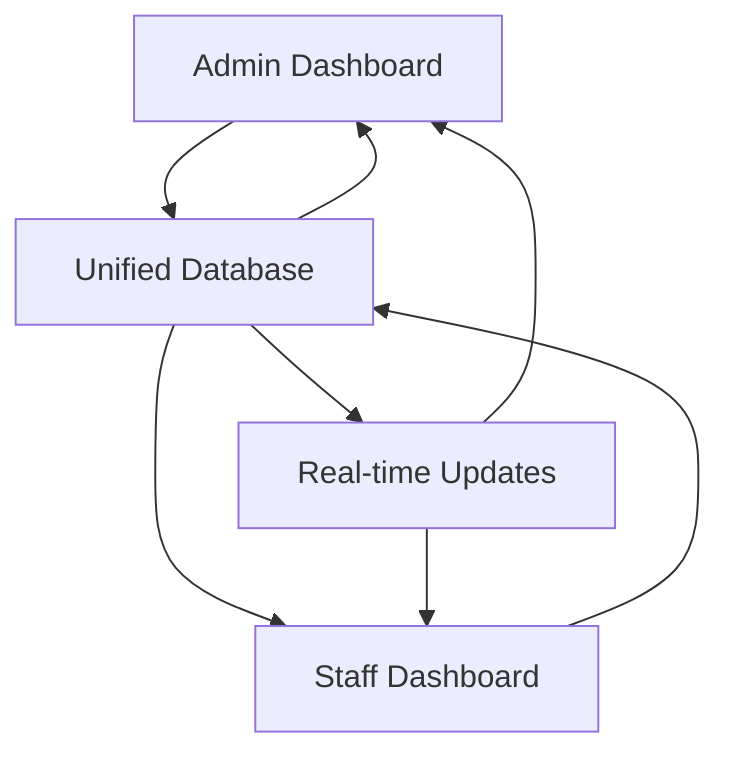

# Unified Database System for Ialibu Secondary School Management

## Overview

This unified database system provides **a single, comprehensive database** that captures and manages **ALL data** for both the **Admin Dashboard** and **Staff Dashboard** in the Ialibu Secondary School Management System. The database ensures real-time synchronization, data consistency, and optimal performance across all user interfaces.

## 🎯 **Key Benefits of Unified Database**

### ✅ **Single Source of Truth**
- **One database** serves both Admin and Staff dashboards
- **Real-time synchronization** - changes made in one dashboard instantly appear in the other
- **Data consistency** - no duplicate or conflicting information
- **Centralized data management** - easier backup, maintenance, and security

### ✅ **Comprehensive Data Coverage**
- **Student Management** - Complete student profiles, enrollment, and academic records
- **Attendance Tracking** - Daily attendance with real-time updates across dashboards
- **Advanced Grading System** - PNG Education Standards with multiple assessment components
- **Financial Management** - School fees, payments, and outstanding balances
- **Staff Management** - Complete staff records and user access control
- **Report Generation** - Automated report cards with calculated metrics
- **System Audit** - Complete activity logging for accountability

### ✅ **Role-Based Data Access**
- **Admin Dashboard** - Full access to all data and management functions
- **Staff Dashboard** - Appropriate access levels for teaching staff
- **Secure permissions** - Data protection with user-based access control

## 🏗️ **Database Architecture**

### **Core Tables Structure**

```sql
📊 UNIFIED DATABASE: ialibu_school_unified
├── 👥 users              (Authentication & Authorization)
├── 🎓 students           (Student Information & Enrollment)
├── 📅 attendance         (Daily Attendance Records)
├── 📝 grades             (Academic Performance & Assessments)
├── 💰 finance            (School Fees & Payment Tracking)
���── 👨‍🏫 staff              (Staff Management)
├── 📋 student_reports    (Generated Report Cards)
└── 📋 audit_log         (System Activity Tracking)
```

### **Real-Time Data Synchronization**



## 📊 **Data Usage by Dashboard**

### **Admin Dashboard - Full Access**

| **Feature** | **Tables Used** | **Access Level** | **Functionality** |
|-------------|----------------|------------------|-------------------|
| **Student Management** | `students` | Full CRUD | Add, edit, delete, view all students |
| **Attendance Overview** | `attendance`, `students` | Full CRUD | View all attendance, generate reports |
| **Grade Management** | `grades`, `students` | Full CRUD | View all grades, analytics, performance metrics |
| **Financial Management** | `finance`, `students` | Full CRUD | Complete fee management, payment tracking |
| **Staff Management** | `staff`, `users` | Full CRUD | Manage all staff, user accounts, permissions |
| **System Users** | `users` | Full CRUD | Create/manage system access accounts |
| **Comprehensive Reports** | All tables | Read/Generate | Advanced analytics, system-wide reports |

### **Staff Dashboard - Teaching Access**

| **Feature** | **Tables Used** | **Access Level** | **Functionality** |
|-------------|----------------|------------------|-------------------|
| **My Students** | `students` | Read/Limited Edit | View assigned students, update subjects |
| **Attendance Recording** | `attendance`, `students` | Create/Read | Record daily attendance for classes |
| **Grade Entry** | `grades`, `students` | Create/Read/Edit | Enter grades for assigned subjects |
| **Student Reports** | `student_reports`, `grades`, `attendance` | Create/Read | Generate individual student reports |
| **Performance Overview** | `grades`, `attendance` | Read | View class performance analytics |

## 📋 **Database Schema Details**

### **1. Students Table - Core Student Information**
```sql
CREATE TABLE students (
    id INT PRIMARY KEY AUTO_INCREMENT,
    name VARCHAR(100) NOT NULL,
    grade ENUM('Grade 9', 'Grade 10', 'Grade 11', 'Grade 12') NOT NULL,
    class VARCHAR(10) NOT NULL,                    -- 9A, 9B, 10A, etc.
    subjects JSON NOT NULL,                        -- Array of enrolled subjects
    date_of_birth DATE NOT NULL,
    gender ENUM('Male', 'Female', 'Other') NOT NULL,
    address TEXT NOT NULL,
    email VARCHAR(100),
    phone VARCHAR(20),
    guardian_name VARCHAR(100),
    guardian_phone VARCHAR(20),
    student_id VARCHAR(20) UNIQUE,                 -- ISS2024001, etc.
    is_active BOOLEAN DEFAULT TRUE,
    created_at TIMESTAMP DEFAULT CURRENT_TIMESTAMP,
    updated_at TIMESTAMP DEFAULT CURRENT_TIMESTAMP ON UPDATE CURRENT_TIMESTAMP
);
```

**Usage:**
- **Admin Dashboard**: Complete student management, enrollment, class assignments
- **Staff Dashboard**: View assigned students, update subject enrollments

### **2. Attendance Table - Real-Time Tracking**
```sql
CREATE TABLE attendance (
    id INT PRIMARY KEY AUTO_INCREMENT,
    date DATE NOT NULL,
    student_id INT NOT NULL,
    student_name VARCHAR(100) NOT NULL,           -- Denormalized for performance
    status ENUM('Present', 'Absent', 'Late') NOT NULL,
    subject VARCHAR(100) NOT NULL,
    notes TEXT,
    recorded_by INT NOT NULL,                     -- Staff member who recorded
    created_at TIMESTAMP DEFAULT CURRENT_TIMESTAMP,
    updated_at TIMESTAMP DEFAULT CURRENT_TIMESTAMP ON UPDATE CURRENT_TIMESTAMP
);
```

**Real-Time Synchronization:**
- Staff records attendance → Instantly visible in Admin dashboard
- Admin views all attendance → Real-time updates from all staff
- Automatic attendance statistics calculation

### **3. Grades Table - PNG Education Standards**
```sql
CREATE TABLE grades (
    id INT PRIMARY KEY AUTO_INCREMENT,
    student_id INT NOT NULL,
    student_name VARCHAR(100) NOT NULL,
    class VARCHAR(10) NOT NULL,
    subject VARCHAR(100) NOT NULL,
    -- PNG Assessment Components (stored as JSON arrays)
    weekly_tests JSON,              -- 20% weight, up to 6 tests
    projects JSON,                  -- 25% weight, up to 6 projects  
    assignments JSON,               -- 20% weight, up to 6 assignments
    take_home_tests JSON,           -- 15% weight, up to 6 tests
    open_book_tests JSON,           -- 10% weight, up to 6 tests
    end_of_term_tests JSON,         -- 10% weight, up to 6 tests
    total_marks DECIMAL(5,2) NOT NULL,
    letter_grade ENUM('D', 'C', 'UP', 'P', 'F') NOT NULL,
    term ENUM('Term 1', 'Term 2', 'Term 3', 'Term 4') NOT NULL,
    academic_year VARCHAR(9) NOT NULL DEFAULT '2024',
    recorded_by INT NOT NULL
);
```

**PNG Grading Scale:**
- **D (Distinction)**: 85-100%
- **C (Credit)**: 70-84%
- **UP (Ungraded Pass)**: 55-69%
- **P (Pass)**: 40-54%
- **F (Fail)**: Below 40%

### **4. Finance Table - School Fees Management**
```sql
CREATE TABLE finance (
    id INT PRIMARY KEY AUTO_INCREMENT,
    student_id INT NOT NULL,
    student_name VARCHAR(100) NOT NULL,
    amount DECIMAL(10,2) NOT NULL,
    date DATE NOT NULL,
    status ENUM('Paid', 'Pending', 'Overdue') NOT NULL DEFAULT 'Pending',
    description TEXT NOT NULL,
    payment_method ENUM('Cash', 'Bank Transfer', 'Cheque', 'Other'),
    receipt_number VARCHAR(50),
    recorded_by INT NOT NULL
);
```

**Financial Integration:**
- **Admin Dashboard**: Complete financial management, payment processing
- **Staff Dashboard**: View-only access to student financial status
- **Automated Calculations**: Outstanding balances, payment histories

## 🔄 **Real-Time Synchronization Features**

### **Instant Data Updates**
1. **Attendance Sync**: Staff records attendance → Admin sees immediately
2. **Grade Sync**: Grade entries → Real-time performance analytics
3. **Student Updates**: Profile changes → Synchronized across dashboards
4. **Financial Updates**: Payment status → Immediate reflection in reports

### **Automatic Calculations**
- **GPA Calculation**: Weighted assessment scores using PNG standards
- **Attendance Rates**: Real-time percentage calculations
- **Financial Status**: Automatic balance calculations
- **Report Generation**: Auto-populated report cards with current data

## 🚀 **Performance Optimizations**

### **Strategic Indexing**
```sql
-- High-performance indexes for dashboard queries
CREATE INDEX idx_student_grade_class_active ON students(grade, class, is_active);
CREATE INDEX idx_attendance_date_student_status ON attendance(date, student_id, status);
CREATE INDEX idx_grades_student_term_year ON grades(student_id, term, academic_year);
CREATE INDEX idx_finance_student_status_date ON finance(student_id, status, date);
```

### **Optimized Views**
```sql
-- Pre-calculated views for dashboard performance
CREATE VIEW v_active_students AS ...        -- Student lists with metrics
CREATE VIEW v_current_performance AS ...    -- Grade summaries
CREATE VIEW v_financial_overview AS ...     -- Payment status summaries
```

### **Stored Procedures**
```sql
PROCEDURE sp_CalculateGPA(...)              -- Automatic GPA calculation
PROCEDURE sp_CalculateAttendance(...)       -- Attendance statistics
PROCEDURE sp_UpdateFinancialStatus(...)     -- Payment status updates
```

## 📈 **Dashboard-Specific Features**

### **Admin Dashboard Capabilities**
- **Complete Data Access**: View, edit, delete all records
- **Advanced Analytics**: System-wide performance metrics
- **User Management**: Create and manage staff accounts
- **Financial Oversight**: Complete fee management and reporting
- **System Administration**: Audit logs, data management

### **Staff Dashboard Capabilities**
- **Class Management**: Manage assigned students and classes
- **Daily Operations**: Attendance recording, grade entry
- **Student Tracking**: Individual student progress monitoring
- **Report Generation**: Create student report cards
- **Performance Insights**: Class and subject analytics

## 🔐 **Security and Access Control**

### **Role-Based Permissions**
```sql
-- Users table with role-based access
user_type ENUM('admin', 'staff')
permissions JSON  -- Granular permission system
```

### **Audit Trail**
```sql
-- Complete activity logging
CREATE TABLE audit_log (
    user_id, username, user_type, action, 
    table_name, record_id, old_values, new_values, 
    ip_address, user_agent, created_at
);
```

## 🛠️ **Implementation Guide**

### **1. Database Setup**
```bash
# Create the unified database
mysql -u root -p < database/unified_school_database.sql

# Verify setup
mysql -u root -p -e "USE ialibu_school_unified; SHOW TABLES;"
```

### **2. Configuration**
```env
# .env file configuration
DB_HOST=localhost
DB_USER=your_username
DB_PASSWORD=your_password
DB_NAME=ialibu_school_unified
DB_PORT=3306
```

### **3. Application Integration**
```javascript
const { UnifiedDatabase } = require('./config/unified_database_config');
const db = new UnifiedDatabase();

// Example: Get all students for both dashboards
const students = await db.getAllStudents();

// Example: Record attendance (Staff Dashboard)
await db.recordAttendance(attendanceData, staffUserId);

// Example: View finance records (Admin Dashboard)
const payments = await db.getFinanceRecords({ status: 'Pending' });
```

## 📊 **Data Migration from Current System**

If migrating from the current localStorage-based system:

```javascript
// Migration script to transfer data
const migrateFromLocalStorage = async () => {
  const currentData = JSON.parse(localStorage.getItem('school_management_data'));
  
  // Migrate students
  for (const student of currentData.students) {
    await db.addStudent(student);
  }
  
  // Migrate attendance
  for (const attendance of currentData.attendance) {
    await db.recordAttendance([attendance], 1);
  }
  
  // Migrate grades, finance, etc.
  // ... continue migration
};
```

## 🎯 **Benefits Summary**

### **For Administrators**
- **Complete System Control**: Full access to all school data
- **Real-Time Monitoring**: Instant visibility into all school operations
- **Advanced Analytics**: Comprehensive reporting and performance metrics
- **Efficient Management**: Centralized data management and user control

### **For Teaching Staff**
- **Streamlined Operations**: Easy attendance recording and grade entry
- **Student Focus**: Detailed access to assigned students and classes
- **Real-Time Updates**: Immediate reflection of data changes
- **Professional Reports**: Automated report card generation

### **For the School System**
- **Data Integrity**: Single source of truth with automatic synchronization
- **Performance**: Optimized database design for fast operations
- **Scalability**: Designed to handle growing student populations
- **Security**: Comprehensive audit trails and role-based access
- **Compliance**: Follows PNG Education Standards and requirements

## 🚀 **Future Enhancements**

The unified database is designed to support future features:
- **Parent Portal**: Extended access for parents to view student progress
- **Mobile App Integration**: API-ready for mobile applications
- **Advanced Analytics**: Machine learning for predictive analytics
- **Integration Capabilities**: Ready for external system integrations
- **Multi-Campus Support**: Scalable for multiple school locations

---

**This unified database system ensures that both Admin and Staff dashboards operate from the same reliable, consistent, and real-time data source, providing the foundation for efficient school management at Ialibu Secondary School.**
